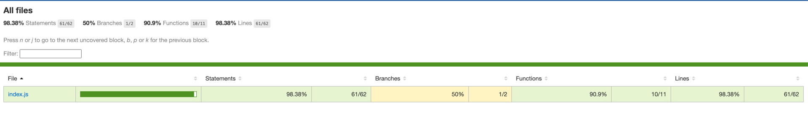

## Setup

Welcome to this short report. The tests covers approx 98% of the total code.

To run the tests yourself from scratch, simply execute the following commands:

``
npm install
``

``
npm run dev
``

Building Coverage report

``
npm run test-coverage
``

``
npm run test:coverage:report
``

To see the full report, please open the report page at `coverage/index.html`.

## Coverage Report

Make sure you have npm installed.

The project should open automatically in your browser at localhost:8080

## What is covered and how

The test file is located under `cypress/e2e/spec.cy.js`

Happy path test cases scenarios and failed scenarios should be covered as best as possible.

* UI Tests
* Logic Tests
* Shape creation test cases
* Failure Cases

Lenny Siemeni